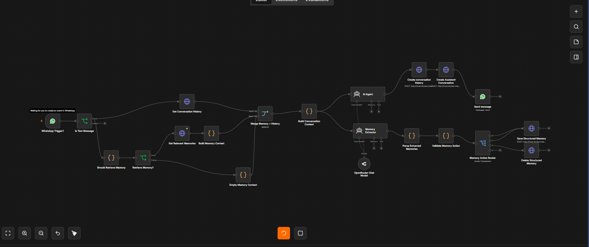
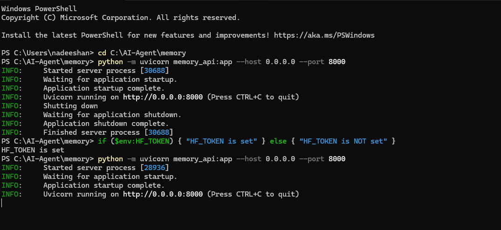

# AI Agent Memory System

> A structured long-term memory architecture for AI agents, designed to provide persistent user memory, context-aware conversations, semantic retrieval, memory lifecycle management, and reliable memory operations.

---

## Table of Contents

* [Overview](#overview)
* [Project Goals](#project-goals)
* [Core Features](#core-features)
* [AI Agent Capabilities](#ai-agent-capabilities)
* [System Architecture](#system-architecture)
* [Memory Architecture](#memory-architecture)
* [Memory Data Model](#memory-data-model)
* [Memory Lifecycle](#memory-lifecycle)
* [Memory Actions](#memory-actions)
* [Semantic Memory Retrieval](#semantic-memory-retrieval)
* [Relevance Scoring](#relevance-scoring)
* [Retrieval Filtering](#retrieval-filtering)
* [Temporary and Expiring Memory](#temporary-and-expiring-memory)
* [Memory Context Construction](#memory-context-construction)
* [Memory Extraction](#memory-extraction)
* [Memory Validation](#memory-validation)
* [Conversation History](#conversation-history)
* [FastAPI Memory Service](#fastapi-memory-service)
* [Database Architecture](#database-architecture)
* [Database Indexing](#database-indexing)
* [n8n Integration](#n8n-integration)
* [Local Deployment](#local-deployment)
* [Technology Stack](#technology-stack)
* [Project Structure](#project-structure)
* [Security](#security)
* [Installation](#installation)
* [Configuration](#configuration)
* [Running the API](#running-the-api)
* [Engineering Principles](#engineering-principles)
* [Skills Demonstrated](#skills-demonstrated)
* [Future Improvements](#future-improvements)
* [License](#license)

---

# Overview

The **AI Agent Memory System** is a standalone memory subsystem designed for conversational AI agents.

The system separates **conversation history** from **long-term structured memory**, allowing an AI agent to retain useful information about a user across multiple conversations while retrieving only the information relevant to the current interaction.

Instead of treating memory as a collection of unstructured conversation text, the system represents each memory using structured attributes such as:

* User
* Category
* Key
* Value
* Source
* Importance
* Confidence
* Embedding
* Memory type
* Expiration
* Creation time
* Update time

This architecture enables reliable memory creation, updating, deletion, semantic retrieval, duplicate detection, expiration handling, and controlled memory injection into an AI agent.
#Workflow_images





---

# Project Goals

The system is designed to address the main requirements of persistent AI-agent memory.

### Persistent Memory

Allow the AI agent to retain important user information beyond the current conversation.

### Context-Aware Conversations

Provide the agent with relevant previous conversation context together with relevant long-term memories.

### Structured Memory

Store durable information as structured records rather than relying entirely on raw conversation history.

### Semantic Retrieval

Retrieve memories according to semantic meaning instead of depending only on exact keyword matching.

### Memory Lifecycle Management

Support the complete lifecycle of a memory:

```text
Extraction
    ↓
Validation
    ↓
Create / Update / Delete
    ↓
Storage
    ↓
Retrieval
    ↓
Expiration
    ↓
Cleanup
```

### Reliability

Prevent invalid operations, duplicate records, corrupted embeddings, expired memories, and memory-related failures from affecting the complete AI-agent workflow.

---

# Core Features

## Persistent User Memory

The system stores durable information associated with individual users.

Memory records can represent information such as:

* Personal information
* Interests
* Preferences
* Skills
* Learning areas
* Other information that is useful for future conversations

---

## Context-Aware Conversations

The AI agent combines three sources of information before generating a response:

```text
Previous Conversation
        +
Relevant Long-Term Memory
        +
Current User Message
        ↓
     AI Agent
```

This allows the agent to maintain continuity without treating the entire memory database as conversation context.

---

## Memory Creation

The system can create a new memory when the memory extractor identifies new information that is worth retaining.

Memory creation is processed through validation and duplicate checks before the record is stored.

---

## Memory Updating

When a user provides new information that corresponds to an existing memory key, the existing memory can be updated rather than creating another independent record.

This prevents unnecessary memory duplication and allows memories to evolve over time.

---

## Memory Deletion

The system supports explicit memory deletion.

When a user requests that information be forgotten, the corresponding memory can be removed from persistent storage.

---

## Duplicate Detection

The system checks for existing memories before inserting new records.

Duplicate prevention can consider structured identity such as:

```text
User
+
Category
+
Key
+
Value
```

Semantic similarity is also used as part of memory-quality protection.

---

## Semantic Memory Retrieval

Memories contain vector embeddings that allow the system to retrieve information based on semantic similarity.

The retrieval process is conceptually:

```text
User Query
    ↓
Query Embedding
    ↓
Memory Embeddings
    ↓
Similarity Calculation
    ↓
Relevance Scoring
    ↓
Filtering
    ↓
Relevant Memories
```

---

## Importance and Confidence

Each memory can contain:

* **Importance** — how valuable the memory is for future interactions
* **Confidence** — how confident the system is that the stored information is correct

These values are used together with semantic similarity during retrieval.

---

## Temporary Memory

The system supports memories that are valid only for a limited period.

Temporary memories can contain an expiration timestamp and are automatically excluded from retrieval after expiration.

---

## Expired Memory Handling

Expired memories are not returned as valid contextual memories.

Expired records can also be removed during cleanup operations.

---

## Fault-Tolerant Retrieval

Invalid or unusable stored embeddings do not need to terminate the entire retrieval operation.

The retrieval process can skip invalid vectors and continue processing valid memories.

---

# AI Agent Capabilities

The memory system provides the foundation for several AI-agent capabilities.

## Persistent User Memory

The agent can retain useful information about a user between conversations.

## Context Awareness

The agent can access relevant previous information when responding to a new message.

## Memory Creation

New information can be extracted from conversations and converted into structured memories.

## Memory Updating

Existing memories can be modified when user information changes.

## Memory Deletion

Users can explicitly request that specific information be forgotten.

## Duplicate Prevention

Repeated information can be identified without generating unnecessary records.

## Semantic Retrieval

The agent can retrieve information based on meaning rather than exact wording.

## Temporary Memory

The system can retain information only for a defined period.

## Memory Quality Management

Importance, confidence, similarity, and filtering are combined to improve retrieval quality.

---

# System Architecture

The project follows a layered architecture separating messaging, workflow orchestration, AI processing, memory management, and persistence.

```text
┌──────────────────────────────┐
│          WhatsApp            │
│      User Interaction        │
└──────────────┬───────────────┘
               │
               ▼
┌──────────────────────────────┐
│             n8n              │
│    Workflow Orchestration    │
└──────────────┬───────────────┘
               │
       ┌───────┴────────┐
       ▼                ▼
Conversation       Memory Retrieval
  History                │
       │                 ▼
       └──────────► AI Agent
                        │
                        ▼
                Memory Extraction
                        │
                        ▼
                Memory Validation
                        │
                        ▼
                 FastAPI Memory API
                        │
                        ▼
                     SQLite
```

The architecture separates responsibilities so that the memory subsystem can operate independently from the messaging and orchestration layers.

## Local Deployment Architecture

The AI agent workflow was developed and executed using a **self-hosted n8n instance running inside Docker**.

Because the n8n server was running locally, an external tunneling service was required to make the webhook endpoint accessible to external services such as WhatsApp.

The local deployment architecture is:

```text
┌──────────────────────┐
│       WhatsApp       │
│    User Messages     │
└──────────┬───────────┘
           │
           │ HTTPS Webhook
           ▼
┌──────────────────────┐
│        ngrok         │
│   Public HTTPS URL   │
└──────────┬───────────┘
           │
           │ Tunnel
           ▼
┌──────────────────────┐
│       Docker         │
│  ┌────────────────┐  │
│  │      n8n       │  │
│  │ Self-Hosted    │  │
│  └───────┬────────┘  │
└──────────┼───────────┘
           │
           ▼
┌──────────────────────┐
│    AI Agent Workflow │
│                      │
│ Memory Retrieval     │
│ Conversation Context │
│ AI Processing        │
│ Memory Extraction    │
└──────────┬───────────┘
           │
           ▼
┌──────────────────────┐
│    FastAPI Memory    │
│        API           │
└──────────┬───────────┘
           │
           ▼
┌──────────────────────┐
│       SQLite         │
│ Conversations +      │
│ Structured Memories  │
└──────────────────────┘
```

### Deployment Components

The local development environment consists of:

* **Docker** — Containerizes and runs the self-hosted n8n instance.
* **n8n** — Provides workflow orchestration for the AI agent.
* **ngrok** — Creates a public HTTPS tunnel to the locally running n8n webhook endpoint.
* **FastAPI** — Provides the memory management API.
* **SQLite** — Provides persistent storage for conversations and structured memories.

This architecture allows the complete AI-agent system to be developed and tested locally while still supporting external webhook-based services.

## Recommended Architecture Summary

The project therefore combines several layers into a single AI-agent memory architecture:

```text
┌───────────────────────────────────────┐
│              User                     │
│             WhatsApp                  │
└──────────────────┬────────────────────┘
                   │
                   ▼
             ┌───────────┐
             │   ngrok   │
             │ HTTPS     │
             │ Tunnel    │
             └─────┬─────┘
                   │
                   ▼
        ┌─────────────────────┐
        │       Docker        │
        │                     │
        │        n8n          │
        │ Workflow Engine     │
        └──────────┬──────────┘
                   │
          ┌────────┴────────┐
          ▼                 ▼
 Conversation          Memory API
   History             FastAPI
                            │
                            ▼
                         SQLite
                            │
                            ▼
                    Structured Memory
                            │
                            ▼
                   Semantic Retrieval
                            │
                            ▼
                        AI Agent
                            │
                            ▼
                       Response
```

The combination of **Docker, n8n, ngrok, FastAPI, SQLite, embeddings, and an AI agent** forms the complete local development architecture of the project.

---

# Memory Architecture

The core of the project is the **structured memory architecture**.

Instead of storing memory as unstructured text, each memory is represented using a defined set of fields.

```text
Memory
│
├── id
├── user_id
├── category
├── key
├── value
├── source
├── importance
├── confidence
├── embedding
├── memory_type
├── expires_at
├── created_at
└── updated_at
```

This structure provides a consistent representation for creation, retrieval, modification, and lifecycle management.

---

# Memory Data Model

## ID

A unique identifier for each memory record.

## User ID

Identifies the user associated with the memory.

This allows memories to remain isolated between users.

## Category

Groups memories into logical types.

Typical categories include:

* Personal information
* Interests
* Preferences
* Skills
* Learning information

## Key

Identifies the specific attribute represented by the memory.

Keys provide a structured identity for memory updates and duplicate detection.

## Value

Contains the actual remembered information.

## Source

Identifies where the memory originated.

The source can be used for traceability and memory-quality analysis.

## Importance

Represents how important the memory is.

Higher importance can increase the memory's priority during retrieval.

## Confidence

Represents how confident the system is that the memory is correct.

This allows uncertain information to receive lower retrieval priority.

## Embedding

A vector representation of the memory used for semantic retrieval.

The embedding is generated from the structured memory content and stored with the memory.

## Memory Type

The system supports different memory lifecycles, primarily:

```text
long_term
temporary
```

## Expiration

Temporary memories can contain an expiration timestamp.

Expired memories are excluded from retrieval.

## Timestamps

The system records:

* Creation time
* Last update time

These timestamps support lifecycle management, auditing, ordering, and cleanup.

---

# Memory Lifecycle

Memory management follows a controlled lifecycle.

```text
User Conversation
       ↓
Memory Extraction
       ↓
Validation
       ↓
Existing Memory Check
       ↓
┌──────┼─────────────┐
│      │             │
CREATE UPDATE       DELETE
│      │             │
└──────┼─────────────┘
       ↓
Embedding / Storage
       ↓
Semantic Retrieval
       ↓
Context Construction
       ↓
AI Agent
       ↓
Expiration / Cleanup
```

This lifecycle prevents memory operations from bypassing validation and storage rules.

---

# Memory Actions

The system uses three primary memory actions.

## CREATE

Creates a new memory when no appropriate existing memory is present.

## UPDATE

Updates an existing memory when the corresponding structured memory already exists but its information has changed.

## DELETE

Removes a memory when the user explicitly requests that the information no longer be retained.

The action-based design allows the memory extraction system and API to communicate using a consistent structured operation model.

---

# Semantic Memory Retrieval

Semantic retrieval allows the system to find memories based on meaning.

The process uses embeddings and cosine similarity rather than depending entirely on exact string matching.

```text
Stored Memory
      ↓
Structured Memory Content
      ↓
Embedding Model
      ↓
Memory Vector
```

During retrieval:

```text
Current User Message
        ↓
Query Embedding
        ↓
Similarity with Stored Vectors
        ↓
Candidate Memories
        ↓
Relevance Scoring
        ↓
Filtered Results
```

This architecture enables the system to retrieve conceptually relevant memories even when the wording of the current message differs from the stored memory.

---

# Relevance Scoring

The system combines semantic similarity with memory quality.

The current scoring model is:

```text
relevance_score =
    similarity
    × importance
    × confidence
```

This prevents semantic similarity from being the only factor that determines which memories are returned.

A highly similar memory with low confidence or low importance can therefore receive a lower final score.

---

# Retrieval Filtering

Similarity thresholds are used to prevent weak matches from being injected into the AI-agent context.

Filtering can consider:

* Minimum semantic similarity
* Relative similarity to the strongest result
* Memory quality
* Expiration status
* User ownership
* Valid embeddings

This helps reduce irrelevant context and unnecessary token usage.

---

# Temporary and Expiring Memory

The memory system distinguishes between long-term and temporary information.

## Long-Term Memory

Long-term memory is intended for information expected to remain useful.

## Temporary Memory

Temporary memory is intended for information that should only remain valid for a limited period.

Temporary records use an expiration timestamp:

```text
expires_at
```

During retrieval, records whose expiration time has passed are excluded.

Expired memories can subsequently be removed through cleanup operations.

---

# Memory Context Construction

Retrieved memories are converted into a compact context representation before being passed to the AI agent.

The context contains only relevant memories rather than the complete memory database.

Conceptually:

```text
Retrieved Structured Memories
            ↓
       Context Builder
            ↓
  Compact Memory Context
            ↓
          AI Agent
```

This approach:

* Reduces unnecessary context
* Reduces token consumption
* Improves contextual relevance
* Prevents unrelated memories from influencing responses

---

# Memory Extraction

After a conversation, the memory extraction stage determines whether the user's message contains information worth retaining.

The extraction process converts natural-language information into structured memory actions.

The output contains the required fields for the memory operation, including:

* Action
* Category
* Key
* Value
* Importance
* Confidence
* Memory type
* Expiration information

This structured representation allows the workflow to process memory operations automatically.

---

# Memory Validation

Extracted memory operations are validated before database persistence.

The validation layer verifies:

* JSON structure
* Supported memory actions
* Required fields
* Importance ranges
* Confidence ranges
* Supported memory types
* Expiration values
* Data consistency

Invalid memory operations are rejected rather than blindly written to the database.

---

# Conversation History

Conversation history and long-term memory are treated as two separate systems.

## Conversation History

Stores recent conversational interactions such as:

* User messages
* Assistant messages
* Conversation timestamps

Its primary purpose is to provide recent conversational context.

## Structured Memory

Stores durable information that should remain useful beyond the current conversation.

The AI agent can therefore receive:

```text
Previous Conversation
        +
Relevant Long-Term Memory
        +
Current User Message
```

This separation prevents the memory database from becoming a replacement for conversation history.

---

# FastAPI Memory Service

FastAPI provides the backend interface for the memory subsystem.

The API acts as the boundary between the n8n workflow and the SQLite database.

The service is responsible for operations such as:

* Memory creation
* Memory updates
* Memory deletion
* Memory retrieval
* Semantic similarity calculation
* Relevance scoring
* Expiration handling
* Conversation storage
* Conversation retrieval
* Cleanup operations

This keeps memory management independent from the AI-agent orchestration workflow.

---

# Database Architecture

The project uses **SQLite** as the persistent storage layer.

SQLite is suitable for the current local and self-hosted architecture while keeping deployment simple.

## Conversations Table

```text
conversations
├── id
├── user_id
├── role
├── message
└── created_at
```

## Memories Table

```text
memories
├── id
├── user_id
├── category
├── key
├── value
├── source
├── importance
├── confidence
├── embedding
├── memory_type
├── expires_at
├── created_at
└── updated_at
```

---

# Database Indexing

Indexes improve the performance of frequently used database operations.

The architecture includes indexing for common lookup patterns involving:

* User identity
* Memory category
* Memory key
* Expiration time
* Update time
* Conversation creation time

This is particularly important when retrieving memories or conversation history for a specific user.

---

# n8n Integration

n8n is used as the workflow orchestration layer of the AI agent.

The project uses a **self-hosted n8n instance running locally inside Docker** rather than relying on the hosted n8n cloud service.

The workflow connects the messaging interface, conversation context, AI agent, memory subsystem, and external services.

The high-level workflow is:

```text
WhatsApp
    ↓
Public Webhook
    ↓
n8n
    ↓
Conversation History
    ↓
Memory Retrieval
    ↓
AI Agent
    ↓
Generate Response
    ↓
Memory Extraction
    ↓
Memory Validation
    ↓
Memory CRUD
    ↓
SQLite
```

## Docker-Based n8n

n8n runs inside a Docker container, providing an isolated and reproducible environment for the workflow engine.

Docker is used to:

* Run n8n locally
* Isolate the workflow environment
* Manage the n8n runtime
* Persist n8n data through Docker volumes
* Simplify starting and stopping the self-hosted service

The local n8n instance is accessible through a mapped host port.

## ngrok Tunneling

Since the n8n server runs on the local machine, its webhook endpoints are not directly accessible from the public internet.

**ngrok** is used to create a secure public HTTPS tunnel from the internet to the locally running n8n service.

The communication path is:

```text
External Service
      ↓
Public HTTPS URL
      ↓
    ngrok
      ↓
Local Host
      ↓
Docker
      ↓
n8n Container
      ↓
Webhook Workflow
```

This allows external services such as WhatsApp to send webhook requests to the locally hosted n8n workflow during development and testing.

The tunnel also provides an HTTPS endpoint that can be configured as the webhook callback URL required by external messaging services.

## Local Development Flow

The complete local development environment can therefore be represented as:

```text
                 INTERNET
                    │
                    ▼
              ┌───────────┐
              │  WhatsApp │
              └─────┬─────┘
                    │
                    ▼
              ┌───────────┐
              │   ngrok   │
              └─────┬─────┘
                    │
              HTTPS Tunnel
                    │
                    ▼
        ┌─────────────────────┐
        │       Docker        │
        │                     │
        │  ┌───────────────┐  │
        │  │      n8n      │  │
        │  │   Webhooks    │  │
        │  │  AI Workflow  │  │
        │  └───────┬───────┘  │
        └──────────┼──────────┘
                   │
                   ▼
             FastAPI Memory API
                   │
                   ▼
                SQLite
```

The repository contains a sanitized n8n workflow definition:

```text
n8n/memory-agent-workflow.example.json
```

---

# Local Deployment

The project was developed using a local/self-hosted architecture.

The primary workflow engine runs inside Docker, while the memory subsystem runs as a local FastAPI service.

```text
┌───────────────────────────────┐
│          Local Machine        │
│                               │
│  ┌─────────────────────────┐  │
│  │       Docker            │  │
│  │                         │  │
│  │        n8n              │  │
│  │   Self-Hosted Server    │  │
│  └───────────┬─────────────┘  │
│              │                │
│              ▼                │
│       FastAPI Memory API      │
│              │                │
│              ▼                │
│           SQLite              │
│                               │
└───────────────┬───────────────┘
                │
                │ ngrok Tunnel
                ▼
          Public HTTPS URL
                │
                ▼
          External Services
```

This architecture allows the AI agent to operate locally while still receiving external webhook events.

## Why Docker Was Used

Docker provides an isolated environment for the n8n server and simplifies local deployment.

It also allows n8n to maintain its own runtime environment independently from the host operating system.

## Why ngrok Was Used

The local n8n server is normally accessible only from the local machine.

External services cannot directly access a private localhost address.

ngrok solves this during development by providing:

```text
External Internet
       ↓
Public HTTPS Endpoint
       ↓
ngrok Tunnel
       ↓
localhost
       ↓
Docker
       ↓
n8n
```

This makes it possible to test webhook-driven AI-agent workflows with external platforms while keeping the core development environment local.

---

# Technology Stack

## Python

Primary programming language used for the memory subsystem.

Used for:

* Backend development
* Database operations
* Memory management
* Embedding processing
* Similarity calculations
* Retrieval logic
* Error handling

## FastAPI

Backend framework used to expose the memory subsystem through REST APIs.

## Pydantic

Used for structured request and data validation.

## SQLite

Persistent relational database used to store conversations and structured memories.

## Hugging Face

Used for embedding generation and semantic memory representation.

## NumPy

Used for numerical and vector operations, including similarity calculations.

## n8n

Workflow automation and orchestration platform connecting the AI agent, messaging system, memory API, and other services.

## Containerization

### Docker

Docker is used to run the n8n workflow engine as a self-hosted container.

It provides:

* Local n8n deployment
* Environment isolation
* Persistent workflow data
* Consistent runtime configuration
* Easier service management

## Networking and Tunneling

### ngrok

ngrok is used to expose the locally hosted n8n webhook endpoint through a public HTTPS URL.

It provides the bridge between external webhook providers and the locally running Docker-based n8n instance.

The role of ngrok in the architecture is:

```text
Public Webhook
      ↓
    ngrok
      ↓
Local n8n
      ↓
Docker Container
```

ngrok is primarily a **development and testing component** in this project rather than part of the core memory engine.

## WhatsApp

Conversational interface used for user interaction with the AI agent.

## Git and GitHub

Used for source-code management, version control, documentation, and project collaboration.

## Technology Stack Summary

The complete technology stack can be organized as:

| Layer                | Technology   | Purpose                          |
| --------------------- | ------------ | -------------------------------- |
| Programming           | Python       | Memory subsystem                 |
| Backend               | FastAPI      | Memory REST API                  |
| Validation            | Pydantic     | Data validation                  |
| Database              | SQLite       | Persistent storage               |
| Embeddings            | Hugging Face | Semantic representations         |
| Numerical Processing  | NumPy        | Vector calculations              |
| Workflow              | n8n          | AI-agent orchestration           |
| Containerization      | Docker       | Self-hosted n8n runtime          |
| Tunneling             | ngrok        | Public access to local webhooks  |
| Messaging             | WhatsApp     | User interaction                 |
| Version Control       | Git / GitHub | Source control and documentation |

---

# Project Structure

```text
ai-agent-memory-system/
│
├── README.md
├── .gitignore
├── requirements.txt
│
├── memory_api.py
├── init_db.py
│
├── n8n/
│   └── memory-agent-workflow.example.json
│
└── docs/
    └── architecture.md
```

## `memory_api.py`

Main FastAPI application responsible for:

* Memory CRUD operations
* Database access
* Semantic retrieval
* Embedding processing
* Relevance scoring
* Expiration handling
* Error handling

## `init_db.py`

Responsible for initializing and maintaining the SQLite database schema.

## `requirements.txt`

Contains the Python dependencies required to run the memory subsystem.

## `n8n/`

Contains sanitized n8n workflow resources used to demonstrate integration with the memory API.

## `docs/`

Contains additional architecture and technical documentation.

## `README.md`

Provides project documentation, architecture information, setup instructions, technologies, and engineering details.

---

# Security

Sensitive credentials and personal data must not be committed to the repository.

The repository should exclude:

```text
API keys
Access tokens
Messaging credentials
AI provider credentials
Hugging Face tokens
.env files
Local databases containing personal information
Private conversation history
```

Credentials should be provided through environment variables or the credential-management features of the relevant platform.

The actual production database should remain outside version control when it contains personal or private memory data.

---

# Installation

## Clone the Repository

```bash
git clone https://github.com/YOUR_USERNAME/ai-agent-memory-system.git
cd ai-agent-memory-system
```

## Create a Virtual Environment

```bash
python -m venv .venv
```

## Activate the Environment

Windows PowerShell:

```powershell
.venv\Scripts\Activate.ps1
```

## Install Dependencies

```bash
pip install -r requirements.txt
```

## Initialize the Database

```bash
python init_db.py
```

---

# Configuration

Environment-specific credentials should be configured outside the source code.

For example:

```powershell
$env:HF_TOKEN="YOUR_HUGGING_FACE_TOKEN"
```

The application should access credentials through environment variables rather than hard-coded values.

n8n credentials should be configured through n8n's credential management system.

---

# Running the API

Start the FastAPI service using Uvicorn:

```bash
python -m uvicorn memory_api:app --host 0.0.0.0 --port 8000
```

The memory API is then available locally through:

```text
http://localhost:8000
```

---

# Engineering Principles

## Separation of Concerns

The architecture separates:

```text
Messaging
    ↓
Workflow Orchestration
    ↓
AI Processing
    ↓
Memory Management
    ↓
Database Persistence
```

Each component has a defined responsibility.

---

## Structured Data Over Unstructured Memory

Durable user information is stored as structured records instead of treating the complete conversation history as memory.

---

## Retrieval Before Context Injection

The complete memory database is never required as AI context.

Instead:

```text
User Message
    ↓
Relevant Memory Retrieval
    ↓
Filtered Memories
    ↓
AI Context
```

This improves relevance and reduces unnecessary context.

---

## Memory and Conversation Separation

Conversation history is responsible for recent interaction context.

Structured memory is responsible for durable user information.

This distinction creates a clearer and more maintainable AI-agent architecture.

---

## Reliability First

Memory failures should not unnecessarily break the complete AI-agent workflow.

The system therefore incorporates:

* Validation
* Controlled error handling
* Duplicate prevention
* Invalid-embedding protection
* Expiration filtering
* Retrieval filtering
* Database-level organization

---

## Independent Memory Service

The memory subsystem is implemented as a separate backend service.

This allows the same memory architecture to be integrated with different:

* AI agents
* Messaging platforms
* Workflow engines
* User interfaces
* LLM providers

without redesigning the core memory layer.

---

# Skills Demonstrated

## AI Agent Engineering

* AI agent architecture
* Persistent agent memory
* Context management
* Memory-aware prompt construction
* LLM workflow integration
* Structured AI outputs
* Agent workflow orchestration

## Memory Engineering

* Long-term memory architecture
* Structured memory design
* Memory lifecycle management
* Memory creation and updates
* Memory deletion
* Duplicate detection
* Semantic memory retrieval
* Memory quality management
* Temporary memory
* Expiration handling
* Memory consolidation concepts
* Retrieval filtering

## Backend Development

* Python
* FastAPI
* REST API development
* Pydantic validation
* API error handling
* Modular backend architecture

## Database Engineering

* SQLite
* Relational database design
* Database schema design
* Schema initialization
* CRUD operations
* Database indexing
* Query optimization
* Data lifecycle management

## Semantic Search

* Text embeddings
* Vector representations
* Cosine similarity
* Semantic retrieval
* Relevance scoring
* Similarity-based filtering

## Workflow Automation

* n8n
* Workflow orchestration
* Conditional processing
* API integration
* AI-agent workflows
* External service integration

## Containerization and Local Deployment

* Docker
* Containerized application deployment
* Self-hosted n8n
* Docker-based workflow environments
* Local service management
* Persistent container data

## Networking and Webhooks

* Webhook architecture
* HTTPS tunneling
* ngrok
* Local-to-public service exposure
* External webhook integration
* Development networking

## Integration Engineering

* WhatsApp integration
* REST API integration
* AI service integration
* Local and self-hosted services
* Backend-to-workflow communication

## Software Engineering

* Separation of concerns
* Modular architecture
* Input validation
* Error handling
* Configuration management
* Security awareness
* Version control
* Technical documentation

---

# Future Improvements

Potential future development areas include:

* Vector database support for larger memory collections
* More advanced memory consolidation
* Automatic memory importance adjustment
* Memory conflict resolution
* Memory versioning
* Improved memory provenance
* Better temporal reasoning
* Advanced user-specific memory policies
* Distributed database support
* Authentication and authorization for the memory API
* Observability and monitoring
* Memory analytics
* Automated memory quality evaluation
* Multi-agent memory sharing
* Pluggable embedding providers

---

# License

This project is intended as an educational and engineering project demonstrating the design and implementation of a structured memory subsystem for AI agents.

Add the appropriate open-source license to this repository according to the intended distribution and usage of the project.
